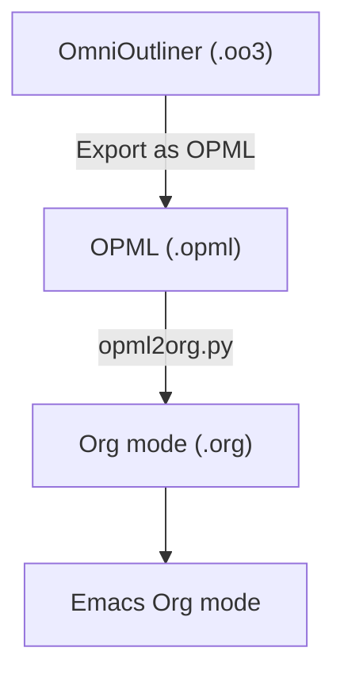
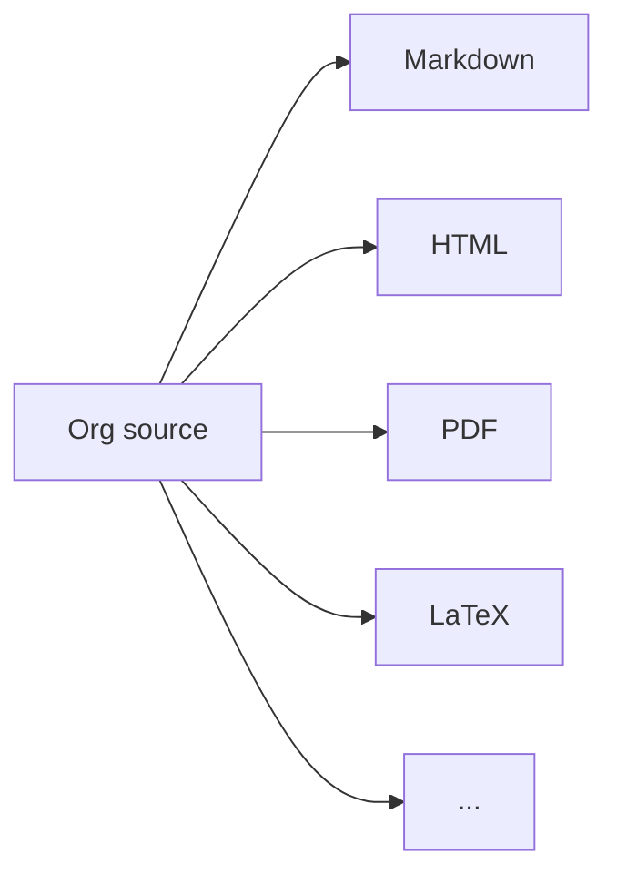

# opml2org

I have used OmniOutliner for years to organize notes, ideas, projects, course material and all kinds of structured information. It is a great outliner, but as I have gradually moved more of my workflow into Emacs, I wanted my outlines there as well.

More importantly, I wanted my data in an open, text-based format that I can edit with any text editor, search with standard Unix tools, keep in Git and process with scripts.

Emacs Org-Mode turned out to be a very natural replacement for OmniOutliner.

This script, `opml2org.py`, was written with help from AI to help me migrate my existing OmniOutliner documents to Org mode.

## The migration

OmniOutliner can export documents as OPML (Outline Processor Markup Language). OPML preserves the hierarchical structure of an outline, which makes it an excellent intermediate format for this migration.

In OmniOutliner, I exported my documents using:

**File → Export → OPML**

I decided to keep these OPML files as an archive of the exported OmniOutliner data. They are also useful as a portable intermediate format if I ever want to import the outlines into another application.

The migration therefore looks like this:



The original `.oo3` files can also be kept as a final backup.

## Converting the files

To convert a single OPML file:

```bash
./opml2org.py document.opml
```

This creates:

```text
document.org
```

An entire directory containing OPML files can also be converted:

```bash
./opml2org.py ~/Documents/OmniOutliner-OPML ~/Documents/org
```

The directory hierarchy is preserved during conversion.

For example:

```text
OmniOutliner-OPML/
├── Courses/
│   ├── Linux.opml
│   └── Kubernetes.opml
└── Projects/
    └── Ideas.opml
```

becomes:

```text
org/
├── Courses/
│   ├── Linux.org
│   └── Kubernetes.org
└── Projects/
    └── Ideas.org
```

Existing Org files are not overwritten by default. Use `--overwrite` if that is really what you want:

```bash
./opml2org.py --overwrite document.opml
```

## From OPML to Org

The basic conversion is straightforward because OPML and Org mode are both hierarchical.

An OPML structure such as:

```xml
<outline text="Linux">
  <outline text="Networking">
    <outline text="DNS"/>
    <outline text="DHCP"/>
  </outline>
</outline>
```

becomes:

```org
* Linux
** Networking
*** DNS
*** DHCP
```

The script also handles some characteristics of OmniOutliner's OPML export.

Empty rows are ignored, document titles are converted to Org metadata, links are converted to Org links and long or multiline leaf rows are treated as body text instead of producing enormous headings.

OmniOutliner-specific user-interface information such as window position, scroll position, and expansion state is intentionally discarded. The goal is to migrate the document and its structure, not to reproduce OmniOutliner's internal state.

## Using Emacs as an outliner

Org mode provides the outlining features I relied on in OmniOutliner directly inside Emacs.

Given a document such as:

```org
* Courses
** Linux
*** Networking
*** Storage
** Kubernetes
*** Pods
*** Deployments
* Projects
** Website
** Documentation
```

I can navigate and manipulate the hierarchy using normal Org mode commands.

Some particularly useful keys are:

| Key | Action |
|---|---|
| `TAB` | Fold or unfold the current subtree |
| `S-TAB` | Cycle visibility for the entire document |
| `M-↑` | Move a heading/subtree up |
| `M-↓` | Move a heading/subtree down |
| `M-←` | Promote a heading |
| `M-→` | Demote a heading |

Because an Org heading represents an entire subtree, moving a heading also moves everything below it.

That gives me much of the same experience I had in OmniOutliner:

```text
Project
├── Planning
│   ├── Requirements
│   └── Architecture
├── Implementation
│   ├── Backend
│   └── Frontend
└── Documentation
```

but the underlying document is now just plain text.

## Why Org mode?

Moving to Org mode gives me more than just another outliner.

My outlines are now UTF-8 text files. I can keep them in Git, search them with tools such as `grep` and `rg`, manipulate them with scripts, link between documents and edit them over SSH or on systems where OmniOutliner is not available.

Org mode also gives me features that go beyond traditional outlining, including TODO states, tags, properties, timestamps, links, tables, source-code blocks and powerful search and agenda functionality.

And when I need Markdown, HTML, PDF, or another format, Org can be used as the source format and the document can be exported.

The workflow becomes:



Instead of storing my information inside an application, I store it in plain-text documents and use Emacs as the interface.

## Goodbye, OmniOutliner

OmniOutliner served me well, and this project is not an attempt to reproduce every OmniOutliner feature.

The goal of `opml2org.py` is much simpler: provide a practical escape route for my existing outlines.

Export the documents as OPML, convert them to Org, put them under version control and continue working in Emacs.

No proprietary document format is required for my day-to-day work anymore.

My outlines are now just text.

And I like it that way.

## Like this project?

If `opml2org.py` helped you escape a proprietary file format, migrate your OmniOutliner documents or simply made your Emacs life a little easier, feel free to buy me a coffee.

It helps support my open-source work and, more importantly, keeps the Emacs configuration experiments going.

<a href="https://www.buymeacoffee.com/jonasbjork" target="_blank">
  
</a>

Thanks for your support! ❤️

.jonas


